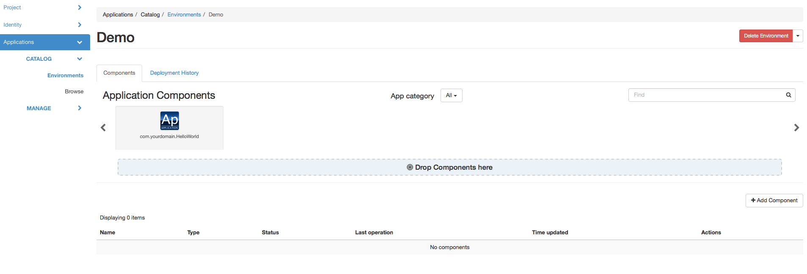
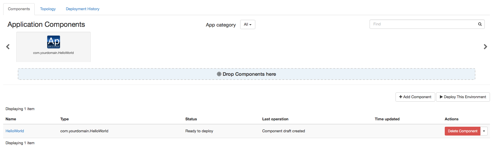
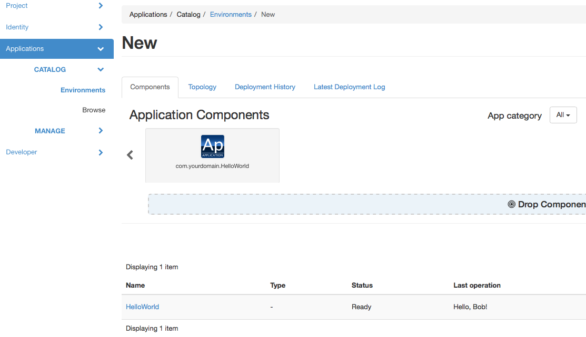

Part 2: Customizing your Application Package
--------------------------------------------

We've built a classic "Hello, World" application during the first part of
this tutorial, now let's play a little with it and customize it for better
user and developer experience - while learning some more Murano features,
of course.

Adding user input
~~~~~~~~~~~~~~~~~

Most deployment scenarios for cloud applications require user input. It may
be various options which should be applied in software configuration files,
passwords for default administrator's accounts, IP addresses of external
services to register with and so on. Murano Application Packages may define
the user inputs they expect, prompt the end-users to pass the values as these
inputs, so that they may utilize these values during application lifecycle
workflows.

In Murano user input is defined for each class as `input properties`.
`Properties` are object-level variables of the class, they may be of different
kinds, and the `input properties` are the ones which are expected to contain
user input. See :ref:`class_props` for details on other kinds of them.

To define properties of the class you should add a ``Properties`` block
somewhere in the YAML file of that class.

.. note::
  Usually it is better to place this block after the ``Name`` and ``Extends``
  blocks but before the ``Methods`` block. Following this suggestion will
  improve the overall readability of your code.

The ``Properties`` block should contain a YAML dictionary, mapping the names of
the properties to their descriptions. These descriptions may specify the kind
of properties, the restrictions on the type and value of the property
(so-called `contracts`), provide default value for the property and so on.

Let's add some user input to our "Hello, World" application. Let's ask the end
user to provide their name, so the application will greet the user instead of
the whole world. To do that, we need to edit our ``com.yourdomain.HelloWorld``
class to look the following way:

.. code-block:: yaml
   :linenos:
   :emphasize-lines: 5-8

   Name: com.yourdomain.HelloWorld

   Extends: io.murano.Application

   Properties:
     username:
       Usage: In
       Contract: $.string().notNull()

   Methods:
     deploy:
       Body:
         - $reporter: $this.find('io.murano.Environment').reporter
         - $reporter.report($this, "Hello, World!")

On line 6 we declare a property named ``username``, on line 7 we specify that
it is an input property, and on line 8 we provide a contract, i.e. a
restriction on the value. This particular one states that the property's value
should be a string and should not be null (i.e. should be provided by the
user).

.. note::
    Although there are a total of 7 different kinds of properties, it turns
    out that the input ones are the most common. So, for input properties you
    may omit the ``Usage`` part - all the properties without an explicit usage
    are considered to be input properties.

Once the property is declared within the ``Properties`` block, you may access
it in the code of the class methods. Since the properties are object-level
variables they may be accessed by calling a ``$this`` variable (which is a
reference to a current instance of your class) followed by a dot and a property
name. So, our ``username`` property may be accessed as ``$this.username``.

Let's modify the ``deploy`` method of our class to make use of the property to
greet the user by name:

.. code-block:: yaml

   Methods:
    deploy:
      Body:
       - $reporter: $this.find('io.murano.Environment').reporter
       - $reporter.report($this, "Hello, " + $this.username + "!")

OK, let's try it. Save the file and archive your package directory again, then
re-import your zip-file to the Murano Catalog as a package.
You'll probably get a warning, since the package with the same name already
exists in the catalog (we imported it there in the previous part of the
tutorial), so murano CLI will ask you if you want to update it. In production
it is better to make a newer version of our application and thus to have both
in the catalog, but for now let's just overwrite the old package with the new
one.

But you cannot deploy it with the old json input we used in the previous part:
since the property's contract has that ``.notNull()`` part it means that the
input should contain the value for the property. If you attempt to deploy an
application without this value, you'll get an error.

So, let's edit the ``input.json`` file we created in the previous part and add
the value of the property to the input:

.. code-block:: json
   :linenos:
   :emphasize-lines: 11

   [
     {
       "op": "add",
       "path": "/-",
       "value": {
         "?": {
           "name": "Demo",
           "type": "com.yourdomain.HelloWorld",
           "id": "42"
          },
         "username": "Alice"
       }
     }
   ]

Save the json file and repeat the steps from the previous part to create an
environment, open a configuration session, add an application and deploy it.
Now in the 'Last Operation' of Murano Dashboard you will see the updated
reporting message, containing the username:

.. image:: hello-world-screen-2.png
   :width: 100%

Adding user interface
~~~~~~~~~~~~~~~~~~~~~

As you can see in all the examples above, deploying applications via Murano
CLI is quite a cumbersome process: the user has to create environments and
sessions and provide the appropriate json-based input for the application.

This is inconvenient for a real user, of course. The CLI is intended to be used
by various external automation systems which interact with Murano via scripts,
but the human users will use Murano Dashboard which simplifies all those
actions and provides a nice interface for them.

Murano Dashboard provides a nice interface to create and deploy environments
and manages sessions transparently for the end users, but when it comes to the
generation of input JSON it can't do it out of the box: it needs some hints
from the package developer. By having hints, Murano Dashboard will be able to
generate nicely looking wizard-like dialogs to configure applications and add
them to an environment. In this section we'll learn how to create these UI
hints.

The UI hints (also called `UI definitions`) should be defined in a separate
YAML file (yeah, YAML again) in your application package. The file should be
named ``ui.yaml`` and placed in a special directory of your package called
``UI``.

The main section which is mandatory for all the UI definitions is called
``Application``: it defines the object structure which should be passed as the
input to Murano. That's it: it is equivalent to the JSON ``input.json`` we were
creating before. The data structure remains the same: ?-header is for system
properties and all other properties belong inside the top level of the object.

The ``Application`` section for our modified "Hello, World" application should
look like this:

.. code-block:: yaml
   :linenos:

   Application:
     ?:
        type: com.yourdomain.HelloWorld
     username: Alice

This input is almost the same as the ``input.json`` we used last time, except
that the data is expressed in a different format. However, there are several
important differences: there are not JSON-Patch related keywords ("op", "path"
and "value") - that's because Murano Dashboard will generate them
automatically.

Same is true for the missing ``id`` and ``name`` from the ?-header of the
object: the dashboard will generate the id on its own and ask the end-user for
the name, and then will insert both into the structure it sends to Murano.

However, there is one problem in the example above: it has the ``username``
hardcoded to be Alice. Of course we do not want the user input to be hardcoded:
it won't be an input then. So, let's define a user interface which will ask the
end user for the actual value of this parameter.

Since Murano Dashboard works like a step-by-step wizard, we need to define at
least one wizard step (so-called `form`) and place a single text-box control
into it, so the end-user will be able to enter his/her name there.

These steps are defined in the ``Forms`` section of our ui definition file.
This section should contain a list of key-value pairs. Keys are the identifiers
of the forms, while values should define a list of `field` objects. Each field
may define a name, a type, a description, a requirement indicator and some
other attributes intended for advanced usage.

For our example we need a single step with a single text field. The ``Forms``
section should look like this:

.. code-block:: yaml
   :linenos:

   Forms:
     - step1:
         fields:
           - name: username
             type: string
             description: Username of the user to say 'hello' to
             required: true

This defines the needed textbox control in the ui. Finally, we need to bind
the value user puts into that textbox to the appropriate position in our
``Application`` section. To do that we replace the hardcoded value with an
expression of form ``$.<formId>.<fieldName>``. In our case this will be
``$step1.username``.

So, our final UI definition will look like this:

.. code-block:: yaml
   :linenos:

   Application:
     ?:
        type: com.yourdomain.HelloWorld
     username: $.step1.username

   Forms:
     - step1:
         fields:
           - name: username
             type: string
             description: Username of the user to say 'hello' to
             required: true

Save this code into your ``UI/ui.yaml`` file and then re-zip your package
directory and import the resulting archive to Murano Catalog again.

Now, let's deploy this application using Murano Dashboard.

Open Murano Dashboard with your browser, navigate to
"Applications/Catalog/Environments" panel, click the "Create Environment"
button, enter the name for your environment and click "Create". You'll be
taken to the contents of your environment: you'll see that it is empty, but on
top of the screen there is a list of components you may add to it. If your
Murano Catalog was empty when you started this tutorial, this list will
contain just one item: your "Hello, World" application. The screen should look
like this:

Drag-n-drop your "com.yourdomain.HelloWorld" application from the list on top
of the screen to the "Drop components here" panel beneath it. You'll see a
dialog, prompting you to enter a username:

.. image:: configure-step1.png
   :width: 100%

Enter the name and click "Next". Although you've configured just one step of
the wizard, the actual interface will consist of two: the dashboard always adds
a final step to prompt the user to enter the name of the application instance
within the environment:

.. image:: configure-step2.png
   :width: 100%

When you click "Create" button an instance of your application will be added to
the environment, you'll see it in the list of components:

So, now you may click the "Deploy this Environment" button and the application
will greet the user with the name you've entered.

Simplifying code: namespaces
~~~~~~~~~~~~~~~~~~~~~~~~~~~~

Now that we've learned how to simplify the user's life by adding a UI
definition, let's simplify the developer's life a bit.

When you were working with Murano classes in the previous part you probably
noticed that the long class names with all those domain-name-based segments
were hard to write and that it was easy to make a mistake:

.. code-block:: yaml
   :linenos:

   Name: com.yourdomain.HelloWorld

   Extends: io.murano.Application

   Methods:
    deploy:
      Body:
        - $reporter: $this.find('io.murano.Environment').reporter
        - $reporter.report($this, "Hello, World!")

To simplify the code we may use the concept of `namespaces` and `short names`.
All but last segments of a long class name are namespaces, while the last
segment is a short name of a class. In our example ``com.yourdomain`` is a
namespace while the ``HelloWorld`` is a short name.

Short names have to be unique only within their namespace, so they tend to be
expressive, short and human readable, while the namespaces are globally unique
and thus are usually long and too detailed.

Murano provides a capability to abbreviate long namespaces with a short alias.
Unlike namespaces, aliases don't need to be globally unique: they have
to be unique only within a single file which uses them. So, they may be very
short. So, in your file you may abbreviate your ``com.yourdomain`` namespace
as ``my``, and standard Murano's ``io.murano`` as ``std``. Then instead of a
long class name you may write a namespace alias followed by a colon character
and then a short name, e.g. ``my:HelloWorld`` or ``std:Application``. This
becomes very helpful when you have lots of class names in your code.

To use this feature, declare a special section called ``Namespaces`` in your
class file. Inside that section provide a mapping of namespace aliases to full
namespaces, like this:

.. code-block:: yaml

   Namespaces:
     my: com.yourdomain
     std: io.murano

.. note::

   Since namespaces are often used in all other sections of files it is
   considered good practice to declare this section at a very top of your
   class file.

Quite often there is a namespace which is used much more often than others in a
given file. In this case it would be beneficial to declare this namespace as a
`default namespace`. Default namespace does not need a prefix at all: you just
type short name of the class and Murano will interpret it as being in your
default namespace. Use '=' character to declare the default namespace in your
namespaces block:

.. code-block:: yaml
   :linenos:
   :emphasize-lines: 2,5

   Namespaces:
     =: com.yourdomain
     std: io.murano

   Name: HelloWorld

   Extends: std:Application

   Methods:
     deploy:
       Body:
         - $reporter: $this.find(std:Environment).reporter
         - $reporter.report($this, "Hello, World!")

Notice that ``Name`` definition at line 5 uses the default namespace: the
``HelloWorld`` is not prefixed with any namespaces, but is properly resolved
to ``com.yourdomain.HelloWorld`` because of the default namespace declaration
at line 2. Also, because Murano recognizes the ``ns:Class`` syntax there is
no need to enclose ``std:Environment`` in quote marks, though it will also
work.

Adding more info for the catalog
~~~~~~~~~~~~~~~~~~~~~~~~~~~~~~~~

As you could see while browsing Murano Catalog your application entry in it is
not particularly informative: the user can't get any description about your
app, and the long domain-based name is not very user-friendly aither.

This can easily be improved. The ``manifest.yaml`` which we wrote in the first
part contained only mandatory fields. This is how it should look by now:

.. code-block:: yaml
   :linenos:

   FullName: com.yourdomain.HelloWorld
   Type: Application
   Description: |
      A package which demonstrates
      development for Murano
      by greeting the user.
   Classes:
     com.yourdomain.HelloWorld: HelloWorld.yaml

Let's add more fields here.

First, you can add a ``Name`` attribute. Unlike ``FullName``, it is not a
unique identifier of the package. But, if specified, it overrides the name of
the package that is displayed in the catalog.

Then an ``Author`` field: here you can put your name or the name of your
company, so it will be displayed in catalog as the name of the package
developer. If this field is omitted, the catalog will consider the package to
be made by "OpenStack", so don't forget this field if you care about your
copyright.

When you add these fields your manifest may look like this:

.. code-block:: yaml
   :linenos:

   FullName: com.yourdomain.HelloWorld
   Type: Application
   Name: 'Hello, World'
   Description: |
      A package which demonstrates
      development for Murano
      by greeting the user.
   Author: John Doe
   Classes:
     com.yourdomain.HelloWorld: HelloWorld.yaml

You may also add an icon to be displayed for your application. To do that just
place a ``logo.png`` file with an appropriate image into the root folder of
your package.

Zip the package directory and re-upload the file to the catalog. Then use
Murano Dashboard and navigate to Applications/Catalog/Browse panel. You'll see
that your app gets a logo, a more appropriate name and a description:

.. image:: hello-world-desc.png
   :width: 50%

So, here we've learned how to improve both the user's and developer's
experience with developing Murano application packages. That was all we could
do with the oversimplistic "Hello World" app. Let's move forward and touch
some real-life applications.
