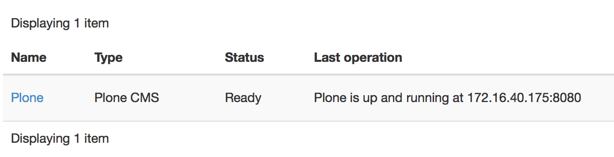

Part 3: Creating a Plone CMS application package
------------------------------------------------

If you've completed "Hello, World" scenarios in the previous parts and are
ready for some serious tasks, we've got a good example here.

Let's automate the deployment of some real application. We've chosen a "Plone
CMS" for this purpose. Plone is a simple, but powerful and flexible Content
Management System which can efficiently run on cloud. Its deployment scenario
can be very simple for demo cases and can become really complicated for
production-grade usage. So it's a good playground: in this part we'll create a
Murano application to address the simplest scenario, then we will gradually add
more features of production-grade deployments.

.. note::
    To learn more about Plone, its features, capabilities and deployment
    scenarios you may visit the `Official website of Plone Foundation
    <http://www.plone.org/>`_.

The goal
~~~~~~~~

Simplest deployment of Plone CMS requires a single server, or, in the case of
OpenStack, a Virtual Machine, to run on. Then a software should be downloaded
and configured to run on that server.

So, as a bare minimum our Plone application package for Murano should automate
the following steps:

#. Provision a virtual machine in OpenStack (VM);
#. Configure ths VM's network connectivity and security;
#. Download a distribution of Plone from Internet to the virtual machine;
#. Install the distribution and configure some of its parameters with user
   input.

Preparation
~~~~~~~~~~~

First let's revisit what we've learned in previous parts and create a new
application package with its manifest and create a class file to contain the
logic of your app.

Create a new directory for a package, call it ``PloneApp``. Create a
``manifest.yaml`` file as described in part 1 of this tutorial in the root of
the package and fill it with data: name your package ``com.yourdomain.Plone``,
set its type to ``Application``, give it a display name of "Plone CMS" and put
your name as the author of the package:

.. code-block:: yaml
   :linenos:

   FullName: com.yourdomain.Plone
   Name: Plone CMS
   Description: Simple Plone Deployment
   Type: Application
   Author: John Doe

Then create a ``Classes`` sub directory inside your package directory and
create a ``plone.yaml`` there. This will be your application class.

At the top of this file declare a `Namespace` section: this will simplify the
code and save time on typing long class names. Make your namespace
(``com.yourdomain``) a default namespace of the file, also include the standard
namespace for Murano applications - ``io.murano``, alias it as ``std``.

Don't forget to include the ``Name`` of your class. Since you've declared a
default namespace for a file you can name your class without a need to type its
long part, just using the shortname.

Also include the ``Extends`` section: same as in our "Hello, World" example
this application will inherit the ``io.murano.Application`` class, but since
we've aliased this namespace as well, it may be shortened to
``std:Application``

By now your class file should look like this:

.. code-block:: yaml

   Namespaces:
     =: com.yourdomain
     std: io.murano

   Name:  Plone

   Extends: std:Application

We'll add the actual logic in the next section. Now, save the file and include
it into the ``Classes`` section of your manifest.yaml, which should now look
like this:

.. code-block:: yaml
   :linenos:
   :emphasize-lines: 6-7

   FullName: com.yourdomain.Plone
   Name: Plone CMS
   Description: Simple Plone Deployment
   Type: Application
   Author: John Doe
   Classes:
     com.yourdomain.Plone: plone.yaml

You are all set and ready to go. Let's add the actual deployment logic.

Library classes
~~~~~~~~~~~~~~~

Murano comes bundled with a so-called "Murano Core Library" - a Murano Package
containing the classes to automate different scenarios of interaction with
other entities such as OpenStack services or virtual machines. They follow
object-oriented design: for example, there is a Murano class called
``Instance`` which represents an OpenStack virtual machine: if you create an
object of this class and execute a method called ``deploy`` for it Murano will
do all the needed system calls to OpenStack Services to orchestrate the
provisioning of a virtual machine and its networking configuration. Then this
object will contain information about the state and configuration of the VM,
such as its hostname, ip addresses etc. After the VM is provisioned you can use
its object to send the configuration scripts to the VM to install and configure
software for your application.

Other OpenStack resources such as Volumes, Networks, Ports, Routers etc also
have their corresponding classes in the core library.

Provisioning a VM
~~~~~~~~~~~~~~~~~

When creating your application package you can `compose` your application out
of the components of core library. For example for an application which
should run on a VM you can define an input property called ``instance`` and
restrict the value type of this property to the aforementioned ``Instance``
class with a contract.

Let's do that in the ``plone.yaml`` class file you've created.
First, add a new namespace alias to your ``Namespaces`` section:
shorten ``io.murano.resources`` as ``res``. This namespace of the core
library contains all the resource classes, including the
``io.murano.resources.Instance`` which we need to define the virtual machine:

.. code-block:: yaml
   :emphasize-lines: 4

   Namespaces:
     =: com.yourdomain
     std: io.murano
     res: io.murano.resources

Now, let's add an input property to your class:

.. code-block:: yaml
   :linenos:

   Properties:
     instance:
       Usage: In
       Contract: $.class(res:Instance)

Notice the contract at line 4: it limits the values of this property to the
objects of class ``io.murano.resources.Instance`` or its subclasses.

This defines that your application needs a virtual machine. Now let's ensure
that it is provisioned - or provision it otherwise. Add a ``deploy`` method to
your application class and call instance's deploy method from it:

.. code-block:: yaml
   :linenos:

   Methods:
     deploy:
       Body:
         - $this.instance.deploy()

That's very simple: you just access the ``instance`` property of your current
object and run a method ``deploy`` for it. The core library defines this method
of the ``Instance`` class in an `idempotent` manner: you may call it as many
times as you want: the first call will actually provision the virtual machine
in the cloud, while all the subsequent calls will no nothing, thus you may
always call this method to ensure that the VM was properly provisioned. It's
important since we define it as an input property: theoretically a user can
pass an already-provisioned VM object as input, but you need to be sure.
Always calling the ``deploy`` method is the best practice to follow.

Running a command on the VM
~~~~~~~~~~~~~~~~~~~~~~~~~~~

Once the VM has been provisioned you may execute various kinds of software
configuration scenarios on it to install and configure the actual application
on the VM. Murano supports different types of software configuration tools to
be run on a VM, but the simplest and the most common type is just a shell
script.

To run a shell script on a virtual machine you may use a `static method`
``runCommand`` of class ``io.murano.configuration.Linux``. Since this method is
static you do not need to create any objects of its class: you can just do
something like:

.. code-block:: yaml

   - type('io.murano.configuration.Linux').runCommand($server.agent, 'sudo apt-get update')

or, if we declare another namespace prefix

.. code-block:: yaml

   Namespaces:
     ...
     conf: io.murano.configuration

this may be shortened to

.. code-block:: yaml

   - conf:Linux.runCommand($server.agent, 'sudo apt-get update')

In this case ``$server`` should be a variable containing an object of
``io.murano.resources.Instance`` class, everything you pass as a second
argument (``apt get update`` in the example above) is the shell command to be
executed on a VM. You may pass not just a single line, but a multi-line text:
it will be treated as a shell script.

.. note::
   The shell scripts and commands you send to a VM are executed by a special
   software component running on the VM - a `murano agent`. For the most
   popular distributions of Linux (Debian, Ubuntu, Centos, Fedora, etc.) it
   automatically gets installed on the VM once it is provisioned, but for other
   distribution and non-Linux OSes it has to be manually pre-installed in the
   image. See :ref:`Building Murano Image <building_images>` for details.

Loading a script from a resource file
~~~~~~~~~~~~~~~~~~~~~~~~~~~~~~~~~~~~~

Passing strings as a second argument of a ``runCommand`` method is convenient
for short commands like the ``apt-get update`` shown in an example above.
However for larger scripts it is not that useful. Instead it is preferable
to load a script text from a file and run it. You can do that in Murano.

For example, let's make a script which downloads, unpacks, installs and
configures Plone CMS on our VM. First, create a directory called ``Resources``
inside your package directory. Then, create a file named ``install-plone.sh``
and put the following script there:

.. code-block:: shell

   #!/bin/bash

   #input parameters

   PL_PATH="$1"
   PL_PASS="$2"
   PL_PORT="$3"

   # Write log. Redirect stdout & stderr into log file:
   exec &> /var/log/runPloneDeploy.log
   # echo "Update all packages."
   sudo apt-get update

   # Install the operating system software and libraries needed to run Plone:
   sudo apt-get install python-setuptools python-dev build-essential libssl-dev libxml2-dev libxslt1-dev libbz2-dev libjpeg62-dev

   # Install optional system packages for the handling of PDF and Office files. Can be omitted:
   sudo apt-get install libreadline-dev wv poppler-utils

   # Download the latest Plone unified installer:
   wget --no-check-certificate https://launchpad.net/plone/5.0/5.0.4/+download/Plone-5.0.4-UnifiedInstaller.tgz

   # Unzip the latest Plone unified installer:
   tar -xvf Plone-5.0.4-UnifiedInstaller.tgz
   cd Plone-5.0.4-UnifiedInstaller

   # Set the port that Plone will listen to on available network interfaces. Editing "http-address" param in buildout.cfg file:
   sed -i "s/^http-address = [0-9]*$/http-address = ${PL_PORT}/" buildout_templates/buildout.cfg

   # Run the Plone installer in standalone mode
   ./install.sh --password="${PL_PASS}" --target="${PL_PATH}" standalone

   # Start Plone
   cd "${PL_PATH}/zinstance"
   bin/plonectl start

.. note::
   As you can see, this script uses apt to install the prerequisite software
   packages, so it expects a Debian-compatible Linux distro as the VM operating
   system. This particular script was tested on Ubuntu 14.04. Other distros
   may have a different set of preinstalled software and thus require different
   additional prerequisites.

The comments in the script give the needed explanation: the script installs all
the prerequisites, downloads a targz archive with a distribution of Plone,
unpacks it, edits the ``buildout.cfg`` file to specify the port Plone will
listen at, then runs the installation script which is included in the
distribution. When that script is finished, the Plone daemon is started.

Save the file as ``Resources/install-plone.sh``. Now you may load its contents
into a string variable in your class file. To do that, you need to use another
static method: a ``string()`` method of a ``io.murano.system.Resources`` class:

.. code-block:: yaml

   - $script: type('io.murano.system.Resources').string('install-plone.sh')

or, with the introduction of another namespace prefix

.. code-block:: yaml

   - $script: sys:Resources.string('install-plone.sh')

But before sending this script to a VM, it needs to be parametrized: as you
can see in the script snippet above, it declares three variables which are
used to set the installation path in the VM's filesystem, a default
administrator's password and a listening port. In the script these values are
initialized with stubs ``$1``, ``$2`` and ``$3``, now we need to replace these
stubs with the actual user input. To do that our class needs to define the
appropriate input properties and then do string replacement.

First, let's define the appropriate input properties in the ``Properties``
block of the class, right after the ``instance`` property:

.. code-block:: yaml
   :linenos:
   :emphasize-lines: 6-18

   Properties:
     instance:
       Usage: In
       Contract: $.class(res:Instance)

     installationPath:
       Usage: In
       Contract: $.string().notNull()
       Default: '/opt/plone'

     defaultPassword:
       Usage: In
       Contract: $.string().notNull()

     listeningPort:
       Usage: In
       Contract: $.int().notNull()
       Default: 8080

Now, let's replace the stub values in that script value we've loaded into the
``$script`` variable. This may be done using a ``replace`` function:

.. code-block:: yaml

   - $script: $script.replace({"$1" => $this.installationPath,
        "$2" => $this.defaultPassword,
        "$3" => $this.listeningPort})

Finally, the resulting ``$script`` variable may be passed as a second argument
of a ``runCommand`` method, while the first one should be the ``instance``
property, containing our VM-object:

.. code-block:: yaml

   - conf:Linux.runCommand($this.instance.agent, $script)

Configuring OpenStack Security
~~~~~~~~~~~~~~~~~~~~~~~~~~~~~~

By now we've got code which provisions a VM and a script which deploys and
configures Plone on it. However, in most OpenStack clouds this is not enough:
usually all incoming traffic to all the VMs is blocked by default, so we need
to configure security group of OpenStack to allow the incoming http calls to
our VM on the port our Plone server listens at.

To do that we need to use a ``securityGroupManager`` property of the
``Environment`` class which owns our application. That property contains an
object of type ``io.murano.system.SecurityGroupManager``, which defines a
``addGroupIngress`` method. This method allows us to add a security group rule
to allow incoming traffic of some type through a specific port within a port
range. It accepts a list of YAML objects, each having four keys: ``FromPort``
and ``ToPort`` to define the boundaries of the port range, ``IpProtocol`` to
define the type of the protocol and ``External`` boolean flag to indicate if
the incoming traffic should be be allowed to originate from outside of the
environment (if this flag is false, the traffic will be accepted only from the
VMs deployed by the application in the same Murano environment).

Let's do this in code:

.. code-block:: yaml
   :linenos:

   - $environment: $this.find(std:Environment)
   - $manager: $environment.securityGroupManager
   - $rules:
      - FromPort: $this.listeningPort
        ToPort: $this.listeningPort
        IpProtocol: tcp
        External: true
   - $manager.addGroupIngress($rules)
   - $environment.stack.push()

It's quite straightforward, just notice the last line. It is required, because
current implementation of ``SecurityGroupManager`` relies on Heat underneath -
it modifies the `Heat Stack` associated with our environment, but does not
apply the changes to the actual cloud. To apply them the stack needs to be
`pushed`, i.e. submitted to Heat Orchestration service. The last line does
exactly that.

Notifying end-user on Plone location
~~~~~~~~~~~~~~~~~~~~~~~~~~~~~~~~~~~~

When the deployment is completed and our instance of Plone server starts
listening on a provisioned virtual machine, the end user has one last question
to solve: to find out where it is. Of course, the user may use OpenStack
Dashboard to list all the provisioned VMs, find the one which has just been
created and look for its IP address. But that's inconvenient. It would be much
better if Murano notified the end-user on where to find Plone once it is ready.

We may utilize the same approach we used in the previous parts to say "Hello,
World" - call a ``report`` method of ``reporter`` attribute of the
``Environment`` class. The tricky part is getting the IP address.

Class ``io.murano.resources.Instance`` has an `output property` called
``ipAddresses``. Unlike input properties the output ones are not provided by
users but are set by objects themselves while their methods are executed. The
``ipAddresses`` is assigned during the execution of ``deploy`` method of the
VM. The value is the list of ip addresses assigned to different interfaces of
the machine. Also, if the ``assignFloatingIp`` input property is set to
``true``, another output property will be set during the execution of
``deploy`` - a ``floatingIpAddress`` will contain the floating ip attached to
the VM.

Let's use this knowledge and build a proper report message:

.. code-block:: yaml
   :linenos:

   - $message: 'Plone is up and running at '
   - If: $this.instance.assignFloatingIp
     Then:
       - $message: $message + $this.instance.floatingIpAddress
     Else:
       - $message: $message + $this.instance.ipAddresses.first()
   - $message: $message + ":" + str($this.listeningPort)
   - $environment.reporter.report($this, $message)

Note the usage of ``If`` expression: it is similar to other programming
languages, just uses YAML keys to define the "if" and "else" blocks.

This code creates a string variable called ``$message``, initializes it with
the beginning of the message string, then appends either a floating ip address
of the VM (if it's set) or the first of the regular ips otherwise. Then it
appends a listening port after a colon character - and reports the resulting
message to the user.

Completing the Plone class
~~~~~~~~~~~~~~~~~~~~~~~~~~

We've got all the pieces to deploy our Plone application, now let's combine
them together. Our final class file should look like this:

.. code-block:: yaml

   Namespaces:
     =: com.yourdomain
     std: io.murano
     res: io.murano.resources
     sys: io.murano.system

   Name: Plone

   Extends: std:Application

   Properties:
     instance:
       Usage: In
       Contract: $.class(res:Instance)

     installationPath:
       Usage: In
       Contract: $.string().notNull()
       Default: '/opt/plone'

     defaultPassword:
       Usage: In
       Contract: $.string().notNull()

     listeningPort:
       Usage: In
       Contract: $.int().notNull()
       Default: 8080

   Methods:
     deploy:
       Body:
         - $this.instance.deploy()
         - $script: sys:Resources.string('install-plone.sh')
         - $script: $script.replace({
             "$1" => $this.installationPath,
             "$2" => $this.defaultPassword,
             "$3" => $this.listeningPort
            })
         - type('io.murano.configuration.Linux').runCommand($this.instance.agent, $script)
         - $environment: $this.find(std:Environment)
         - $manager: $environment.securityGroupManager
         - $rules:
           - FromPort: $this.listeningPort
             ToPort: $this.listeningPort
             IpProtocol: tcp
             External: true
         - $manager.addGroupIngress($rules)
         - $environment.stack.push()
         - $formatString: 'Plone is up and running at {0}:{1}'
         - If: $this.instance.assignFloatingIp
           Then:
             - $address: $this.instance.floatingIpAddress
           Else:
             - $address: $this.instance.ipAddresses.first()
         - $message: format($formatString, $address, $this.listeningPort)
         - $environment.reporter.report($this, $message)

That's all, our class is ready.

Providing a UI definition
~~~~~~~~~~~~~~~~~~~~~~~~~

Last but not least, we need to add a UI definition file to define a template
for the user input and create wizard steps.

This time both are a bit more complicated than they were for the "Hello, World"
app.

First, let's create the wizard steps. It's better to decompose the UI into two
steps: the first one will define the properties of a Virtual Machine, and the
second one the configuration properties of the Plone application itself.

.. code-block:: yaml
   :linenos:

   Forms:
     - instanceConfiguration:
         fields:
           - name: hostname
             type: string
             required: true
           - name: image
             type: image
             imageType: linux
           - name: flavor
             type: flavor
           - name: assignFloatingIp
             type: boolean
     - ploneConfiguration:
         fields:
           - name: installationPath
             type: string
           - name: defaultPassword
             type: password
             required: true
           - name: listeningPort
             type: integer

This is familiar to what we had on the previous step, however there are several
new types of fields: while the types ``integer`` and ``boolean`` are quite
obvious - they will render a numeric up-and-down textbox and checkbox controls
respectively - other field types are more specific.

Field of type ``image`` will render a drop-down list allowing you to choose an
image for your VM, and the list of images will contain only the ones having
appropriate metadata associated (the type of metadata is defined by the
``imageType`` attribute: this particular example requires it to be tagged as
"Generic Linux").

Field of type ``flavor`` will render a drop-down list allowing you to choose a
flavor for your VM among the ones registered in Nova.

Field of type ``password`` will render a pair of text-boxes in a password
input mode (i.e. hiding all the input with '*'-characters). The rendered field
will have appropriate validation: it will ensure that the values entered in
both fields are identical (thus providing a "repeat password" functionality)
and will also enforce password complexity check.

This defines the basic UI, but it is not particularly user friendly: when
MuranoDashboard renders the wizard it will label appropriate controls with the
names of the fields, but they usually don't look informative and pretty.

So, to improve the user experience you may add additional attributes to field
descriptors here. ``label`` attribute allows you to define a custom label to be
rendered next to appropriate control, ``description`` allows you to provide a
longer text to be displayed on the form as a description of the control, and,
finally, an ``initial`` attribute allows you define the default value to be
entered into the control when it is shown to the end-user.

Modify the ``Forms`` section to use these attributes:

.. code-block:: yaml
   :linenos:
   :emphasize-lines: 6-9,14-17,20-23,26-28,33-36,38-39,44-46

   Forms:
     - instanceConfiguration:
         fields:
           - name: hostname
             type: string
             label: Host Name
             description: >-
               Enter a hostname for a virtual machine to be created
             initial: plone-vm
             required: true
           - name: image
             type: image
             imageType: linux
             label: Instance image
             description: >-
               Select valid image for the application. Image should already be prepared and
               registered in glance.
           - name: flavor
             type: flavor
             label: Instance flavor
             description: >-
               Select registered in Openstack flavor. Consider that application performance
               depends on this parameter.
           - name: assignFloatingIp
             type: boolean
             label: Assign Floating IP
             description: >-
                Check to assign floating IP automatically
     - ploneConfiguration:
         fields:
           - name: installationPath
             type: string
             label: Installation Path
             initial: '/opt/plone'
             description: >-
               Enter the path on the VM filesystem to deploy Plone into
           - name: defaultPassword
             label: Admin password
             description: Default administrator's password
             type: password
             required: true
           - name: listeningPort
             type: integer
             label: Listening Port
             description: Port to listen at
             initial: 8080

Now, let's add an ``Application`` section to provide templated input for our
app:

.. code-block:: yaml
   :linenos:

   Application:
     ?:
       type: com.yourdomain.Plone
     instance:
       ?:
         type: io.murano.resources.LinuxMuranoInstance
       name: $.instanceConfiguration.hostname
       image: $.instanceConfiguration.image
       flavor: $.instanceConfiguration.flavor
       assignFloatingIp: $.instanceConfiguration.assignFloatingIp
     installationPath: $.ploneConfiguration.installationPath
     defaultPassword: $.ploneConfiguration.defaultPassword
     listeningPort: $.ploneConfiguration.listeningPort

Note the ``instance`` part here: since our ``instance`` input property is not
a scalar value but rather an object, we are placing another object template
inside the appropriate section. Note that the type of this object is not
``io.murano.resources.Instance`` as you could expect based on the property
contract, but a more specific class: ``LinuxMuranoInstance`` in the same
namespace. Since this class inherits the former, it matches the contract, but
it provides a more appropriate implementation than the base one.

Let's combine the two snippets together, we'll get the final UI definition of
our app:

.. code-block:: yaml
   :linenos:

   Application:
     ?:
       type: com.yourdomain.Plone
     instance:
       ?:
         type: io.murano.resources.LinuxMuranoInstance
       name: $.instanceConfiguration.hostname
       image: $.instanceConfiguration.image
       flavor: $.instanceConfiguration.flavor
       assignFloatingIp: $.instanceConfiguration.assignFloatingIp
     installationPath: $.ploneConfiguration.installationPath
     defaultPassword: $.ploneConfiguration.defaultPassword
     listeningPort: $.ploneConfiguration.listeningPort
   Forms:
      - instanceConfiguration:
          fields:
            - name: hostname
              type: string
              label: Host Name
              description: >-
                Enter a hostname for a virtual machine to be created
              initial: 'plone-vm'
              required: true
            - name: image
              type: image
              imageType: linux
              label: Instance image
              description: >-
                Select valid image for the application. Image should already be prepared and
                registered in glance.
            - name: flavor
              type: flavor
              label: Instance flavor
              description: >-
                Select registered in Openstack flavor. Consider that application performance
                depends on this parameter.
            - name: assignFloatingIp
              type: boolean
              label: Assign Floating IP
              description: >-
                Check to assign floating IP automatically
      - ploneConfiguration:
          fields:
            - name: installationPath
              type: string
              label: Installation Path
              initial: '/opt/plone'
              description: >-
                Enter the path on the VM filesystem to deploy Plone into
            - name: defaultPassword
              label: Admin password
              description: Default administrator's password
              type: password
              required: true
            - name: listeningPort
              type: integer
              label: Listening Port
              description: Port to listen at
              initial: 8080

Save this file as a ``ui.yaml`` in a ``UI`` folder of your package. As a final
touch add a logo to the package - save the image below to the root directory of
your package as ``logo.png``:

.. image:: plone-logo.png
   :width: 100

The package is ready. Zip it and import to Murano catalog. We are ready to try
it.

Deploying the package
~~~~~~~~~~~~~~~~~~~~~

Go to Murano Dashboard, create an environment and add a "Plone CMS" application
to it. You'll see the nice wizard with all the field labels and descriptions
you've added to the ui definition file:

.. image:: plone-simple-step1.png
   :width: 50%

.. image:: plone-simple-step2.png
   :width: 50%

After the app is added to the environment, click the "Deploy this environment"
button. The deployment will take about 10 minutes, depending on the speed of
the VM's internet connection and the amount of packages to be updated. When it
is over, check the "Last operation" column in the environment's list of
components near the Plone component. It should contain a message "Plone is up
and running at ..." followed by ip address and port:

Enter this address to the address bar of your browser. You'll see the default
management interface of Plone:

.. image:: plone-admin.png
   :width: 50%

If you click a "Create a new Plone site" button you'll be prompted for username
and password. Use ``admin`` username and the password which you entered in the
Wizard. See `Plone Documentation <http://docs.plone.org>`_ for details on how
to operate Plone.

This concludes this part of the course. The application package we created
demonstrates the basic capabilities of Murano for the deployments of real-world
applications. However, the deployed configuration of Plone is not of
production-grade service: it is just a single VM with all-in-one service
topology, which is not a scalable or fault-tolerant solution.
In the next part we will learn some advanced features which may help to bring
more production-grade capabilities to our package.
