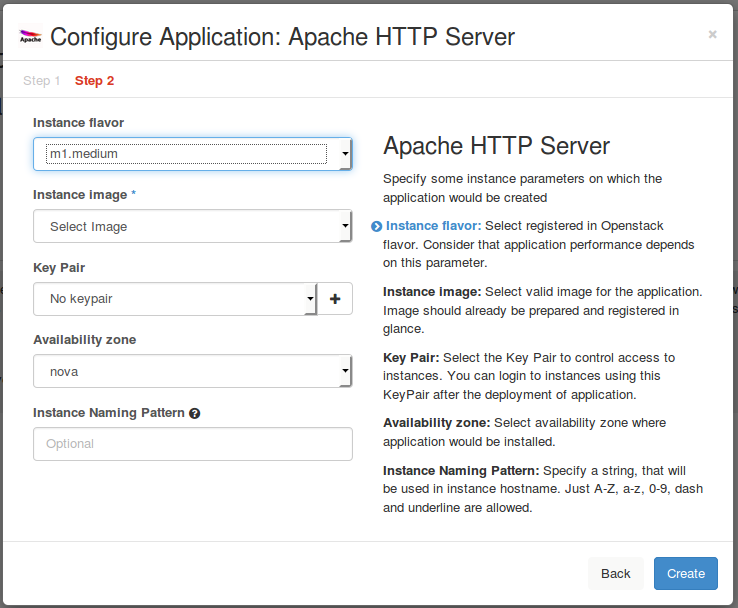

.. _step-by-step:

============
Step-by-Step
============

The goal of this manual is to walk you through the steps
that should be taken while composing an application package
to get it ready for uploading to Murano.

This tutorial uses a demo application named ApacheHTTPServer
to demonstrate how you can create your own Murano application
from scratch. We will walk you through its source code and
explain how to upload it.

ApacheHTTPServer is a simple Murano application that spawns
a virtual machine and installs Apache HTTP Server on it.
It may also install php if a user wants to.

The source code of ApacheHTTPServer is available at `github
<https://github.com/openstack/murano-apps/tree/master/ApacheHTTPServer/package>`_.

ApacheHTTPServer's source code is written in MuranoPL.
This programming language is object-oriented, and we will
see classes, objects and object instances. The detailed
explanation of its syntax can be found in the :ref:`MuranoPL
reference <murano-pl>`.

.. warning::
   Before you start the Murano application creation process, please consider
   the :ref:`System prerequisites <system_prerequisites>` and
   :ref:`Lab requirements <lab_requirements>` in order you do not risk
   starting with a wrong environment

.. toctree::
   :maxdepth: 2

Step 1. Create the structure of the package
~~~~~~~~~~~~~~~~~~~~~~~~~~~~~~~~~~~~~~~~~~~

You should structure an application package very neatly in order
the application could be managed and deployed in the catalog
successfully.

The package structure of ApacheHTTPServer package is::

  ..

   |_  Classes
   |   |_  ApacheHttpServer.yaml
   |
   |_  Resources
   |   |_  scripts
   |       |_runApacheDeploy.sh
   |   |_  DeployApache.template
   |
   |_  UI
   |   |_  ui.yaml
   |
   |_  logo.png
   |
   |_  manifest.yaml

The detailed information regarding the package structure can be found
in the :ref:`Murano packages <murano-packages>` section.

Step 2. Create the manifest file
~~~~~~~~~~~~~~~~~~~~~~~~~~~~~~~~

The application manifest file contains general application metadata.
It is an entry-point for each Murano application, and is very similar
to the manifest of a jar archive. It has a fixed format based on YAML.

The ApacheHTTPServer's manifest file:

.. code-block:: yaml
   :linenos:

    Format: 1.0
    Type: Application
    FullName: io.murano.apps.apache.ApacheHttpServer
    Name: Apache HTTP Server
    Description: |
     The Apache HTTP Server Project is an effort to develop and maintain an
     open-source HTTP server for modern operating systems including UNIX and
     Windows NT.
     ...
    Author: Mirantis, Inc
    Tags: [HTTP, Server, WebServer, HTML, Apache]
    Classes:
     io.murano.apps.apache.ApacheHttpServer: ApacheHttpServer.yaml

Now, let's inspect ``manifest.yaml`` line-by-line.

Format
------

Specifies the version of the format for manifest.yaml to track
the syntax changes. Format key presents in each manifest file.
Currently, available versions are: `1.0`, `1.1`, `1.2` and `1.3`.
For more information, refer to :ref:`format documentation<ManifestFormat>`.

.. code-block:: yaml

   Format: 1.0

Type
----

Specifies the type of the package:

.. code-block:: yaml

   Type: Application

.. note::
  ``Application`` starts with the capital letter.
  This is the naming convention for all the pre-defined values
  in Murano code.

FullName
--------

Stands for the unique service application name. That name
allows to easily recognize to which scope an application
belongs. All other applications can address to the Apache
application methods by this name.

To ensure the global uniqueness, the same naming
convention as the naming convention of Java packages and
classes is followed. The ``io.murano.apps.apache.`` part
is the "package" part of the name, while ``ApacheHttpServer``
stands for the "class" part of the name:

.. code-block:: yaml

   FullName: io.murano.apps.apache.ApacheHttpServer

.. note::

   It is not necessary that all applications belong to one domain.
   This naming allows to determine an application group by its name.
   OpenStack-related applications may have full names, started with
   ``org.openstack.apps``, for example, ``org.openstack.apps.Rally``

Name
----

Stands for the display name of the application. You will be able to reset a display name
when you upload ApacheHTTPServer package to Murano:

.. code-block:: yaml

   Name: Apache HTTP Server

Description
-----------

Contains the application description rendered under the application title:

.. code-block:: yaml
   :linenos:

   Description: |
     The Apache HTTP Server Project is an effort to develop and maintain an
     open-source HTTP server for modern operating systems including UNIX and
     Windows NT. The goal of this project is to provide a secure, efficient and
     extensible server that provides HTTP services in sync with the current HTTP
     standards.
     Apache httpd has been the most popular web server on the Internet since
     April 1996, and celebrated its 17th birthday as a project this February.

Let's take a closer look at the syntax:

The vertical line ``|`` symbol comes from YAML syntax.
The ``>`` symbol can be used interchangeably.
These are the `YAML block style indicators <http://yaml.org/spec/current.html#id2537921>`_,
which mean that all the leading indents and new line symbols should be preserved.
This is very useful for long, multi-line descriptions, because this affects how
they are displayed on the UI.

.. warning::
   Avoid tab symbols inside YAML files. If YAML contains the tab symbol, it will not
   be parsed correctly. The error message may be cryptic or misleading.
   We recommend that you check the YAML syntax before composing the application
   package using any of the available online tools.

Author
------

Contains the name of the author of an application, it is only displayed
in the application details and does not affect anything.

.. code-block:: yaml

   Author: Mirantis, Inc

.. note::
   Single quotes usage is optional here: ``Author: 'Mirantis, Inc'``,
   thus they are omitted in the code extract below.

Tags
----

Is an array of tags. You can search an application by its tag.
You may want to specify several tags for one application:

.. code-block:: yaml

   Tags: [HTTP, Server, WebServer, HTML, Apache]

Besides, YAML allows tag specification using another syntax,
which is an equivalent to the one given above:

.. code-block:: yaml

   Tags:
      - HTTP
      - Server
      - WebServer
      - HTML
      - Apache

Classes
-------

Is a mapping between all classes present in ApacheHttpServer application
and the file names where these classes are defined in. This is one-to-one relationship,
which means that there is one and the only class per a single file.

The line ``io.murano.apps.apache.ApacheHttpServer: ApacheHttpServer.yaml`` says that the class ``io.murano.apps.apache.ApacheHttpServer`` is defined in the file ``ApacheHttpServer.yaml``:

.. code-block:: yaml

   Classes:
    io.murano.apps.apache.ApacheHttpServer: ApacheHttpServer.yaml

Step 3. Create the execution plan template
~~~~~~~~~~~~~~~~~~~~~~~~~~~~~~~~~~~~~~~~~~

The execution plan template contains the instructions understandable to the murano
agent on what should be executed to deploy an application. It is the file with the
``.template`` extension located in the ``/APP_NAME/Resources`` directory.

The ApacheHTTPServer's DeployApache.template:

.. code-block:: yaml
   :linenos:

   FormatVersion: 2.0.0
   Version: 1.0.0
   Name: Deploy Apache

   Parameters:
     enablePHP: $enablePHP

   Body: |
     return apacheDeploy('{0}'.format(args.enablePHP)).stdout

   Scripts:
     apacheDeploy:
       Type: Application
       Version: 1.0.0
       EntryPoint: runApacheDeploy.sh
       Files: []
       Options:
         captureStdout: true
         captureStderr: true

As it can be viewed from the source code, besides specifying versions of different items,
ApacheHTTPServer execution plan accepts the ``enablePHP`` parameter. This parameter is
an input parameter to the ``apacheDeploy.sh`` script. This script initiates ``runApacheDeploy.sh``
execution, which is also located at the ``Resources`` directory and installs apache app and php
if selected.

For the detailed information regarding the execution plan template, its sections and syntax,
please refer to the :ref:`Execution plan template <exec_plan>`.

Step 4. Create the dynamic UI form definition
~~~~~~~~~~~~~~~~~~~~~~~~~~~~~~~~~~~~~~~~~~~~~

ApacheHTTPServer's ui.yaml source code:

.. code-block:: yaml
   :linenos:

   Version: 2

   Application:
     ?:
       type: io.murano.apps.apache.ApacheHttpServer
     name: $.appConfiguration.name
     enablePHP: $.appConfiguration.enablePHP
     instance:
       ?:
         type: io.murano.resources.LinuxMuranoInstance
       name: generateHostname($.instanceConfiguration.unitNamingPattern, 1)
       flavor: $.instanceConfiguration.flavor
       image: $.instanceConfiguration.osImage
       keyname: $.instanceConfiguration.keyPair
       availabilityZone: $.instanceConfiguration.availabilityZone
       assignFloatingIp: $.appConfiguration.assignFloatingIP

   Forms:
     - appConfiguration:
         fields:
           - name: license
             type: string
             description: Apache License, Version 2.0
             hidden: true
             required: false
           - name: name
             type: string
             label: Application Name
             initial: 'ApacheHttpServer'
             description: >-
               Enter a desired name for the application. Just A-Z, a-z, 0-9, dash and
               underline are allowed
           - name: enablePHP
             label: Enable PHP
             type: boolean
             description: >-
                Add php support to the Apache WebServer
             initial: false
             required: false
             widgetMedia:
               css: {all: ['muranodashboard/css/checkbox.css']}
           - name: assignFloatingIP
             type: boolean
             label: Assign Floating IP
             description: >-
                Select to true to assign floating IP automatically
             initial: false
             required: false
             widgetMedia:
               css: {all: ['muranodashboard/css/checkbox.css']}
           - name: dcInstances
             type: integer
             hidden: true
             initial: 1

     ...

Now, let's inspect it line-by-line.

Application
-----------

Defines the object model by which engine deploys the ApacheHTTPServer
application, and includes YAQL expressions.

The section contains the reference to the Apache class,
the one that is provided in the manifest, named with the `?`
symbol. This indicates system information:

.. code-block:: yaml
   :linenos:

    Application:
     ?:
       type: io.murano.apps.apache.ApacheHttpServer

For ApacheHTTPServer application it is defined that the user should input the application name,
some instance parameters and decide whether PHP should be enabled or not:

.. code-block:: yaml

    enablePHP: $.appConfiguration.enablePHP

The `instance` section assumes that the value, entered by the user in the first form
named ``appConfiguration`` is stored in an application object module. The same applies
for the instance parameter. Providing the question mark with the defined type
``io.murano.resources.LinuxMuranoInstance`` indicates an instance of MuranoPl object.

.. code-block:: yaml
   :linenos:

   instance:
      ?:
        type: io.murano.resources.LinuxMuranoInstance

.. note::
   This parameter is named ``instance`` here because its class definition
   property has the ``instance`` name. You can specify any name in
   the :ref:`class definition file <step_5_class_definition>`,
   and then use it in the UI form definition.

Forms
-----

Contains UI forms prototypes that are merged to the application
creation wizard.

Each form field will be translated to the Django field and most of
the parameters correspond to parameters in the Django form field.
All fields are required by default. Hidden fields are used to print
extra information in the form description.

After the upload, the section content will be browsed on the left
side of the form and its description on the right.

Please take a look at the :guilabel:`Configure Application: Apache HTTP Server` dialog:

.. image:: step_1.png

.. note::
   The :guilabel:`assignFloatingIP` and :guilabel:`enablePHP`
   boolean fields are shown as checkboxes.

Here is how the second dialog looks like:

For more information about Dynamic UI, please refer to
:ref:`the main reference <DynamicUISpec>`.

.. _step_5_class_definition:

Step 5: Define MuranoPL class definitions
~~~~~~~~~~~~~~~~~~~~~~~~~~~~~~~~~~~~~~~~~

All application classes are located in the ``Classes`` folder. As ApacheHttpServer
uses only one class, just one file can be found in this directory.

Here is how it looks like:

.. code-block:: yaml
   :linenos:

   Namespaces:
     =: io.murano.apps.apache
     std: io.murano
     res: io.murano.resources
     sys: io.murano.system

   Name: ApacheHttpServer

   Extends: std:Application

   Properties:
     name:
       Contract: $.string().notNull()

     enablePHP:
       Contract: $.bool()
       Default: false

     instance:
       Contract: $.class(res:Instance).notNull()

   Methods:
     initialize:
       Body:
         - $._environment: $.find(std:Environment).require()

     deploy:
       Body:
         - If: not $.getAttr(deployed, false)
           Then:
             - $._environment.reporter.report($this, 'Creating VM for Apache Server.')
             - $securityGroupIngress:
               ...
             - $._environment.securityGroupManager.addGroupIngress($securityGroupIngress)
             - $.instance.deploy()
             - $resources: new(sys:Resources)
             - $template: $resources.yaml('DeployApache.template').bind(dict(enablePHP => $.enablePHP))
             - $._environment.reporter.report($this, 'Instance is created. Deploying Apache')
             - $.instance.agent.call($template, $resources)
             - $._environment.reporter.report($this, 'Apache is installed.')
             - $.setAttr(deployed, true)

Now, let's inspect it line-by-line.

Namespaces
----------

Can be named *shortcuts* since this is an additional section
which enables short names instead of the long ones:

.. code-block:: yaml
   :linenos:

   Namespaces:
     =: io.murano.apps.apache
     std: io.murano
     res: io.murano.resources
     sys: io.murano.system

.. note::
   ``=:`` refers to the *current* namespace

Name
----

Contains the class name that is defined in this file.
So full class name will be current namespace and name, provided by corresponding key:  ``io.murano.apps.apache.ApacheHttpServer``:

.. code-block:: yaml

   Name: ApacheHttpServer

.. note::
   One .yaml file should contain only one class definition.

Extends
-------

Determines inheritance, and ``io.murano.Application`` should be a parent
for all the murano applications.

This class has defined deploy method and only instances of that class can be used in Environment class.
Environment class, in its turn, is responsible for the deployment configurations. Definition of both
classes are located at meta/io.murano folder of murano repository.

Thus, if you want to have some modifications of ApacheHttpServer, you can set io.murano.apps.apache.ApacheHttpServer
in the Extends section of a new Application class:

.. code-block:: yaml

   Extends: std:Application

Properties
----------

Defines the dictionary.
Apache HTTP Server application has three properties: ``name``, ``enablePHP`` and ``instance``.
For each of them certain ``Contract`` is defined.

Only ``enablePHP`` is optional, and its default value equals to ``false``.

``Instance`` is the required parameter and should be an instance of the predefined in core library ``io.murano.resources.Instance`` class.

Methods
-------

The ``initialize`` method is like ``__init__`` in Python, and executes together with properties
initialization.

It accesses the environment, which the application belongs to, and is used only for
sending reports about the deployment state.

Private variable ``_environment`` is defined as follows:

.. code-block:: yaml
   :linenos:

   initialize:
          Body:
            - $._environment: $.find(std:Environment).require()

The ``deploy`` method sets up instance spawning and configuration. This method should be executed
only once. So in the first order deployed variable is checked to be false in the
current scope.

It performs the following actions:

  * configures securityGroups;
  * initiates new virtual machine spawning: ``$.instance.deploy()``
  * loads the execution plan template, located in the ``Resources`` directory to the
    instance of resources class: ``$resources.yaml('DeployApache.template')``
  * updates the plan with parameters taken from the user: ``bind(dict(enablePHP => $.enablePHP))``
  * sends ready-to-execute-plan to murano agent: ``$.instance.agent.call($template, $resources)``

Step 6. Add the application logo (optional)
~~~~~~~~~~~~~~~~~~~~~~~~~~~~~~~~~~~~~~~~~~~

Download or create your own ``.png`` image associated with your application.

The recommended size is 70x70 px, and the square shape is preferable.
There are no limits regarding the image filename. In Apache HTTP Server we
use the default name ``logo.png``:

.. image:: logo.png

Step 7.  Compose a zip archive
~~~~~~~~~~~~~~~~~~~~~~~~~~~~~~

Select all the files prepared for the package and create an archive in zip format.
If the command is executed from the console, do not forget to add the ``-r`` option
to include all the attachments.

.. note::
   The manifest file should not contain the root folder. In other words, the manifest
   should be located in the archive root directory.

|

**Congratulations! Your application is ready to be uploaded to the application catalog.**

.. TODO: add links to "How to upload a package" (OG)

