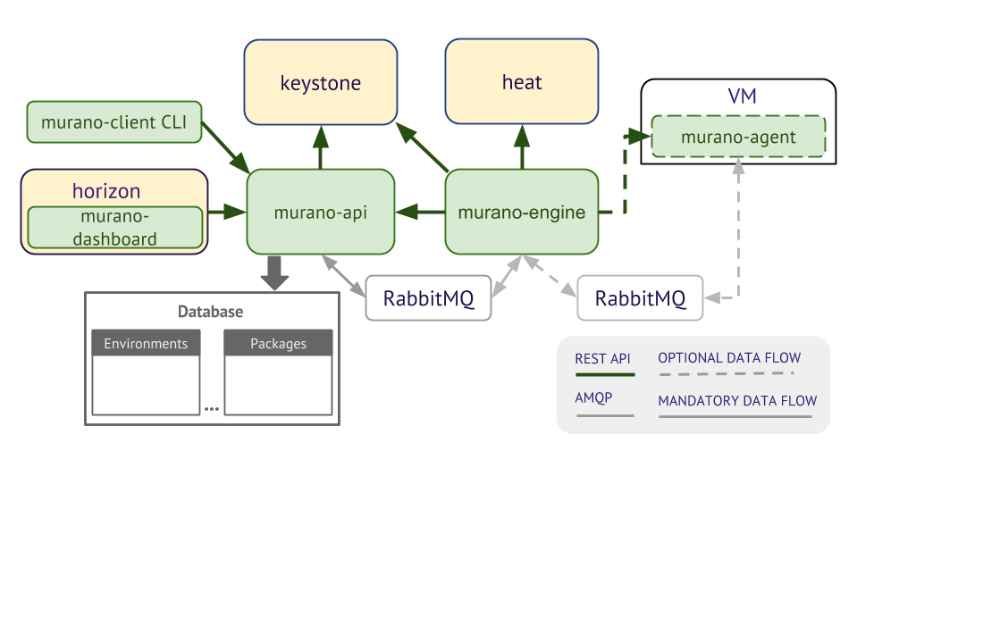

.. _architecture:

============
Architecture
============

Murano uses other OpenStack services in order to prevent reimplementing of
existing functionality. Murano interacts with these services using their REST
API (via their python clients). The most used external services are keystone
and heat.

* Heat is used to orchestrate the infrastructural resources such as servers,
volumes, and networks. Murano dynamically creates the heat templates based on
the application definition.

* All remote operations to the user’s servers are done via an AMQP queue to the
murano-agent. Examples of this are installing and configuring software on the
server. Note that this communication can easily be configured on a separate
instance of AMQP to ensure that the infrastructure and servers are isolated.

